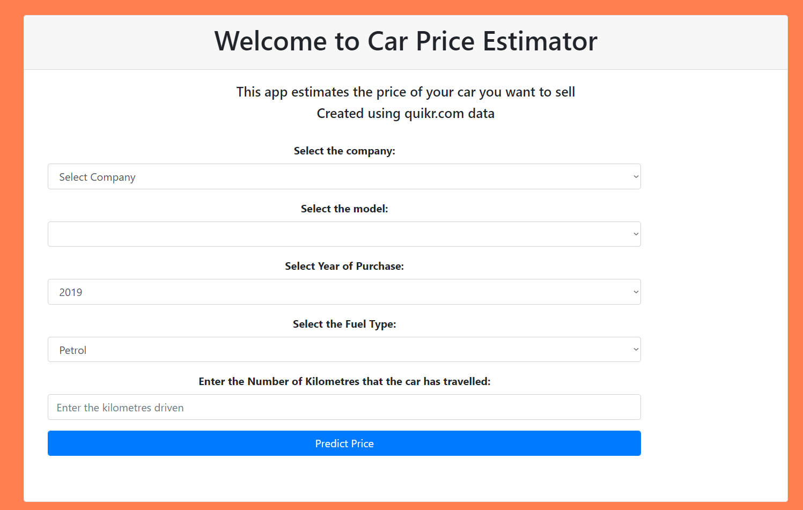

# Car Price Estimator

#How was this project created?

1.First download dataset from Kaggle https://www.kaggle.com/datasets/balaka18/quikr-cars-scraped.
2. Data cleaned (It was very unclean) and analyzed.
3. Then a Linear Regression Model with an R2 score of 0.92 was then built on it.
Link for notebook: https://github.com/Mehmet-Unluturk/Car_Price_Estimator/blob/main/Car_Analysis_Modeling.ipynb
4. A flask site was made where we used a Linear Regression model to perform the predictions
